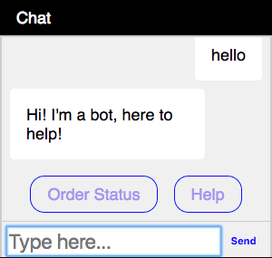

# Botkit Anywhere Web Chat Client

Included in this project is a web-based chat client for use with Botkit Anywhere's built-in chat service.
This client is built with HTML, CSS and Javascript.
It is our hope that it will be easy to customize both the design and the functionality of the chat client with minimal effort.

There are three ways to use the web client:

1. [Embed the widget using an iFrame](#embed-botkit-in-a-website-with-iframes)
2. Link directly to full-screen chat interface
3. Embed the chat interface markup, css and Javascript into an existing web page

### Files

The web chat client is composed of these files:

* HTML user interface [public/chat.html](../public/chat.html)
* Javascript application [public/client.js](../public/client.js)
* Compiled CSS theme [public/css/styles.css](../public/styles.css)
* Source SASS file [sass/_chat.scss](../sass/_chat.scss)

Additional functionality used by the iframe embed:

* Embedded chat app [public/embed.js](../public/embed.js)
* Compiled CSS for embedded window [public/css/embed.css](../public/embed.css)
* Source SASS file [sass/embed.scss](../sass/embed.scss)

## Client API

#### Botkit.boot(user)

Initialize the embedded chat widget.  This will cause the widget to connect to the chat service and start up.

If your website has user accounts, and you want to identify the existing user to the chat widget,
you can include user profile information in the call to Botkit.boot(). This information will appear in the Botkit Studio analytics, and can be used by the bot in other ways.
The user object can contain the following fields:

| Field | Description
|--- |---
| id | REQUIRED a unique identifier of this user
| name | the username / display name of the user
| first_name | first name
| last_name | last name
| full_name | full name
| gender | 'male' or 'female'
| timezone | Timezone description "America/Chicago"

#### Botkit.triggerScript(script_name, thread_name)

Trigger the execution of a Botkit Studio script. This will cause your bot to retrieve the specified script from Botkit Studio's API,
and then perform the specified thread with the user.

This can be used to trigger specific bot actions from the main web page. For example, your bot might respond to a user navigating to the help page,
or offer assistance during an ecommerce checkout flow.

```js
Botkit.triggerScript('help','help_with_checkout');
```

#### Botkit.identifyUser(user)

Identify an existing user to the chat widget. This can be used to identify the user AFTER the chat begins, instead of passing in the information to Botkit.boot().


## Share User Accounts / Profile data with Botkit

In order to seamlessly integrate your new bot with your existing app or website, Botkit supports sharing user account information between the main app and the bot.

To do this, either call [Botkit.boot(user)](#botkitbootuser) with the optional user profile parameter, or call [Botkit.identifyUser(user)](#botkitidentifyuseruser) after the connection has been established.

If provided, user information will be used in a variety of ways:

* [Message history](botkit_chat_server.md#enable-message-history) will be associated with the existing user account
* [Botkit Studio's analytics system](../readme.md#analytics) will display up-to-date user profile data in various reports
* Your Botkit application can access the account information using the [built-in storage mechanisms](https://github.com/howdyai/botkit/blob/master/docs/storage.md), making it easier to use this information during conversations or inside [skill modules](how_to_build_skills.md).

## Embed Botkit in a Website with iFrames

Botkit's web chat can be added to a website using an iframe to embed the chat functionality.
The starter kit application includes a page with the necessary embed code that can be copy-pasted into the source of your website.

An example embed code is below.  It includes the markup for an iframe, as well as Javascript and CSS links for
styling the embedded chat widget. Note, replace `{{base_url}}` with the url of your Botkit application.

```html
<div id="embedded_messenger">
    <header id="message_header" onclick="Botkit.toggle()">Chat</header>
    <iframe  id="botkit_client" src="//{{base_url}}/chat.html"></iframe>
</div>
<script src="//{{base_url}}/embed.js"></script>
<script>
var options = {};
Botkit.boot(options);
</script>
<link rel="stylesheet" href="//{{base_url}}/embed.css" />

```


Using the code above and the built-in stylesheet, the chat widget will look like this:



Once embedded, the chat widget has a few additional methods that allow you to control it from the main web page.

#### Botkit.activate()

Activate the chat widget. If using the built-in stylesheet, this will cause the widget to slide up from the bottom of the screen.

#### Botkit.deactivate()

Deactivate the chat widget. If using the built-in stylesheet, this will cause the widget to disappear, leaving only a small "Chat" widget docked to the bottom of the page.

#### Botkit.toggle()

Toggle the active state of the chat widget.


## Customize the look and feel of the chat interface

The web chat interface is built with HTML and CSS. The look and feel can be extensively customized by modifying the underlying source code. The chat interface is rendered using the [Handlebars template language](http://handlebarsjs.com/).

The uncompiled SASS used to style the web chat is included in the starter kit as `sass/_chat.scss` Changes made to this file must be compiled into the final stylesheet. To do this, run the following command from the root of the starter kit:

```
sass --update sass/:public/css/
```

The annotated boilerplate HTML for Botkit's web client is below.

Note: The functionality of the web chat interface uses the `id` attributes of elements in the template to identify and use them. If you want to use the built in client app, it is important to leave these attributes intact in the template file!

```html
<!-- the client uses the Handlebars template library and the Showdown markdown renderer -->
<script src="https://cdnjs.cloudflare.com/ajax/libs/handlebars.js/4.0.10/handlebars.min.js"></script>
<script src="https://cdn.rawgit.com/showdownjs/showdown/1.7.4/dist/showdown.min.js"></script>

<!-- Include the styleshet -->
<link rel="stylesheet" href="styles.css" />

<!-- this is the template for Botkit's web client -->
<div id="message_window">
    <!-- this bar will appear if the websocket connection is not established -->
    <div class="disconnected">
        Disconnected... reconnecting!
    </div>

    <!-- this bar will appear if the websocket connection has failed to reconnect after a disconnect -->
    <div class="offline">
        Offline! Reload to reconnect.
    </div>

    <!-- this section contains the scrolling list of messages -->
    <section>
        <div id="message_list">

            <!--
              this div is used to format both incoming and outgoing messages.
              they are styled differently based a css class tied to the message.type field
            -->
            <div id="message_template">
                <div class="message {{message.type}}">
                    {{#if message.isTyping}}
                        <div class="typing-indicator">
                            ...
                        </div>
                    {{/if}}

                    {{{message.html}}}

                    <!-- If the open_link field is present in the message, insert a button -->
                    {{#if message.open_link}}
                      <a href="{{{message.open_link}}}" target="_blank" class="button_message">{{#if message.link_title}}{{message.link_title}}{{else}}{{message.open_link}}{{/if}}</a>
                    {{/if}}

                    <!-- if the files field is present in the message, render links to attached files -->
                    {{#message.files}}
                      {{#if image}}
                        
                      {{else}}
                        <a href="{{{url}}}">{{{url}}}</a>
                      {{/if}}
                    {{/message.files}}
                </div>
            </div>
        </div>
    </section>

    <!-- this element contains any quick replies -->
    <div id="message_replies">
    </div>

    <!-- the footer is contains the message composer, and is docked to the footer of the chat -->
    <footer>
        <form onsubmit="Botkit.send(Botkit.input.value, event)">
            <input type="text" autocomplete="off" id="messenger_input" placeholder="Type here..." />
            <button type="submit">Send</button>
        </form>
    </footer>
</div>
```

## Using Botkit Studio custom fields to add custom features

Botkit Studio's dialog authoring CMS supports the ability to add custom fields to any message.
These fields are passed unmodified through the client to your chat widget, and can be used in the template.

You can include any fields you want in your message objects using this feature, and render them however you desire.  The Handlebars template system supports conditionals, iterators and other helper functions which can be used to create interactive elements and more complex attachments.

For example, the code above looks for a `message.open_link` field. This is not a standard Botkit
message field, but can be added to a message using custom fields. If present, a special link button will be added to the rendered message.
